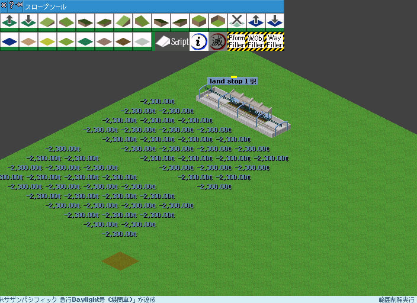

# 説明

指定範囲を一括撤去するスクリプトです。
自社の構造物のみ撤去できます。
公共事業で使用すると他社の構造物も撤去できます。

# 使い方

1. ツールーバーのclear_forceをクリックしてスクリプトを起動
1. 撤去したい範囲をドラッグ




# 導入

1. 解凍したフォルダ(このreadme.txtのあるフォルダ)をpak/toolフォルダに移動する。
1. `cursor.clear_force.pak` をpakフォルダに移動する。
1. `lib_obj_finder_v2.nut`, `lib_mark_v1.nut`, `lib_filler_v2.nut` をpak/toolフォルダに移動する。
1. Simutransを起動してスロープツールにアイコンが表示されていれば導入成功です。

```
pakXYZ
┣━ cursor.clear_force.pak
┣━ tool
┃   ┣━ lib_mark_v1.nut
┃   ┣━ lib_filler_v2.nut
┃   ┣━ clear_force
┃   ┃   ┣━ readme.md
┃   ┃   ┣━ tool.nut
┃   ┃   ┣━ description.tab
```

# 既知の問題

- アイコンがスロープツールにしか表示できなかったのでスロープツールに配置されています。
  - 特殊建築物ツールに移したいですね！

# ソース
https://github.com/128na/sugoi-simutrans-squirrel-scripts

# 更新履歴

※バージョンはスクリプト集共通の値です。

- v2 初版
