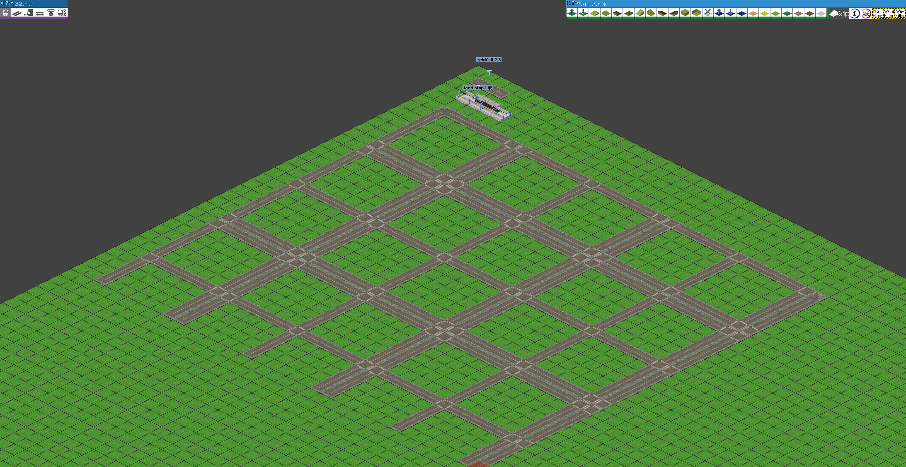
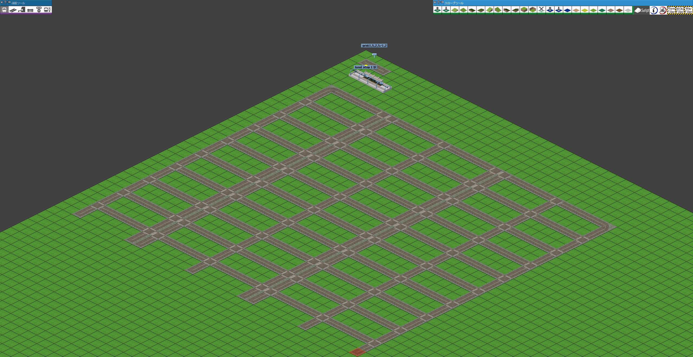

# 説明

指定範囲を指定した軌道を指定ルールでに基づいて埋めるスクリプトです。

# 使い方

1. ツールーバーのgrid_fillerをクリックしてスクリプトを起動
1. マップ内の `[0,0,-2] - [10,10,2]` の範囲に建設したいプレーヤーで軌道を設置する（1マス以上）
1. マップ内の `[0,0,-2] - [10,10,2]` の範囲に建設したいプレーヤーでマーカーを立て、建設書式を記入する
1. 敷設したい範囲をドラッグ
1. 指定範囲内に指定したルールに基づいて指定した軌道が敷設されます


## ルールの書式

書式は `grid:{南北の軌道マス数},{南北の空き地マス数},(繰り返し)/{東西の軌道マス数},{東西の空き地マス数},(繰り返し)` で指定します。

東西方向の指定は省略可能です。省略すると南北方向と同じルールが適用されます。

## 例

### `grid:1,2`

「軌道1マス、2マス空けて…」 を繰り返します。


### `grid:1,5,2,5`

「軌道1マス、5マス空けて、軌道2マス、5マス空けて…」 を繰り返します。



### `grid:1,5,2,5/1,2`

南北方向は 「軌道1マス、5マス空けて、軌道2マス、5マス空けて…」 を繰り返します。
東西方向は 「軌道1マス、2マス空けて…」 を繰り返します。




# 導入

1. 解凍したフォルダ(このreadme.txtのあるフォルダ)をpak/toolフォルダに移動する。
1. `cursor.grid_filler.pak` をpakフォルダに移動する。
1. `lib_obj_finder_v2.nut`, `lib_mark_v1.nut`, `lib_filler_v2.nut` をpak/toolフォルダに移動する。
1. Simutransを起動してスロープツールにアイコンが表示されていれば導入成功です。

```
pakXYZ
┣━ cursor.grid_filler.pak
┣━ tool
┃   ┣━ lib_obj_finder_v2.nut
┃   ┣━ lib_mark_v1.nut
┃   ┣━ lib_filler_v2.nut
┃   ┣━ grid_filler
┃   ┃   ┣━ readme.md
┃   ┃   ┣━ tool.nut
┃   ┃   ┣━ description.tab
```

# スクリプトのパラメーター

|変数名|デフォルト値|説明|
|---|---|---|
|`area`|`[[0, 0, -2],[10, 10, 2]]`|オブジェクトを検知する範囲を指定します。<br>範囲を広げると検索に時間がかかります。|

# 既知の問題

- アイコンがスロープツールにしか表示できなかったのでスロープツールに配置されています。
  - 特殊建築物ツールに移したいですね！

# ソース
https://github.com/128na/sugoi-simutrans-squirrel-scripts

# 更新履歴

※バージョンはスクリプト集共通の値です。

- v3 初版
