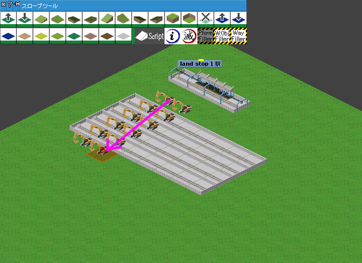
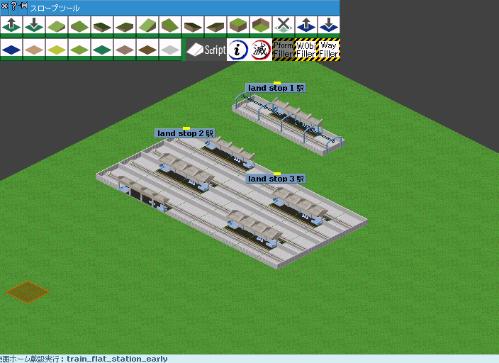

# ホーム範囲建設

指定範囲を指定した駅を並べて埋めるスクリプトです。

# 使い方

1. ツールーバーのplatform_fillerをクリックしてスクリプトを起動
1. マップ内の `[0,0,-2] - [10,10,2]` の範囲に建設したいプレーヤーで軌道と駅を設置する（1マス以上）
1. 敷設したい範囲をドラッグ
1. 選択範囲のうち敷設可能な軌道上にホームが敷設されます
1. ホームの設置順序は始点側から終点側へ向かって建設されます

始点と終点を逆にするとホームの設置順序が変わります。
